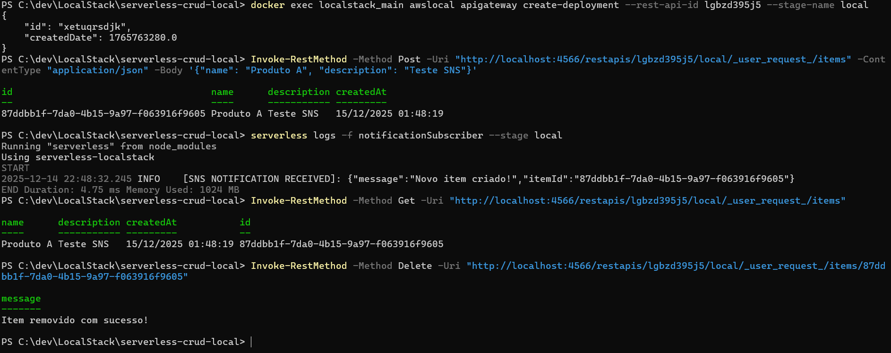

# Projeto Serverless CRUD + LocalStack (Opção A)

Este projeto implementa uma API RESTful utilizando Serverless Framework, AWS Lambda e DynamoDB, rodando localmente via LocalStack. O sistema inclui notificações via Amazon SNS.

## 📋 Pré-requisitos
* Node.js (v18 ou superior)
* Docker & Docker Compose
* Serverless Framework v3 (`npm install -g serverless@3.39.0`)

## 🚀 Como Executar

1. **Instale as dependências:**
   ```bash
   npm install
   ```

2.  **Suba o ambiente LocalStack:**

    ```Bash
    docker-compose up -d
    
    ```
    
3.  **Faça o Deploy:**
    
    ```Bash
    serverless deploy --stage local
    
    ```
    
    _(Caso a API não apareça, force a publicação: `docker exec localstack_main awslocal apigateway create-deployment --rest-api-id lgbzd395j5 --stage-name local`)_
    

## 🧪 Endpoints (Teste)

-   **POST /items**: Cria um item e dispara notificação SNS.
    
-   **GET /items**: Lista todos os itens.
    
-   **PUT /items/{id}**: Atualiza um item.
    
-   **DELETE /items/{id}**: Remove um item.
    

## 🛠 Tecnologias

-   Serverless Framework
    
-   LocalStack (Emulador AWS)
    
-   AWS Lambda, DynamoDB, SNS

## 🔍 Evidências


